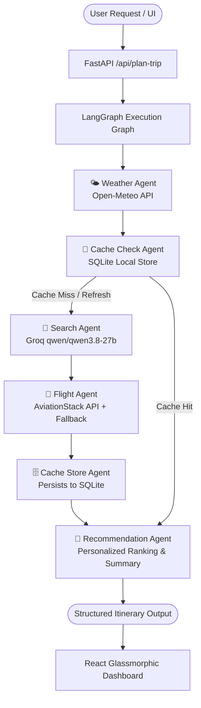

# ✈️ Agentic AI Travel Planner

An enterprise-grade, autonomous **Multi-Agent Travel Itinerary & Recommendation System** built with **LangGraph**, **Groq LLM** (`qwen/qwen3.8-27b`), **FastAPI**, **SQLite**, and a modern **React + Vite** glassmorphism frontend.


---

## 🌟 Architecture & Agent Workflow

The platform orchestrates specialized AI and deterministic agents in a stateful directed acyclic graph (DAG) via **LangGraph**:



### Key Highlights:
1. **Multi-Agent Orchestration**: Independent agents handle distinct domains (meteorological data retrieval, caching strategies, real-time structured flight/hotel synthesis, and contextual ranking).
2. **Ultra-Low Latency Inference**: Powered by **Groq** LPUs running `qwen/qwen3.8-27b` with strict JSON schema adherence and INR (₹) localized pricing.
3. **Dual-Tier Cache Strategy**: Local SQLite engine reduces duplicate LLM calls and network latency for previously queried routes.
4. **Resilient Data Pipelines**: Graceful fallbacks for third-party flight APIs (AviationStack) ensuring zero unhandled exceptions.
5. **Modern Interactive Frontend**: Dynamic airport/IATA search dropdown, localized budget inputs, real-time star rating filters, and high-contrast glassmorphic design.

---

## 📂 Project Structure

```text
travelagent/
├── agents/                     # LangGraph Autonomous Agents
│   ├── cache_agent.py          # SQLite lookup for existing flight/hotel entries
│   ├── flight_api_agent.py     # AviationStack integration with safe fallback
│   ├── recommendation_agent.py # Synthesis & trip summary generation
│   ├── search_agent.py         # Groq LLM structured extraction (Hotels & Flights)
│   └── weather_agent.py        # Real-time weather via Open-Meteo
├── database/                   # Database Abstraction Layer
│   ├── cache.py                # Retrieval logic
│   ├── sqlite_client.py        # SQLite connection & schema initialization
│   └── store_results.py        # Upsert logic for flight/hotel records
├── frontend/                   # React + Vite Client
│   ├── src/
│   │   ├── App.jsx             # Main reactive travel planner application
│   │   ├── index.css           # Custom glassmorphism UI & responsive design
│   │   └── main.jsx
│   └── package.json
├── api.py                      # FastAPI server with CORS & typed request handlers
├── graph.py                    # LangGraph StateGraph pipeline definition
├── state.py                    # Pydantic & TypedDict workflow state definitions
├── main.py                     # CLI runner for terminal-based testing
├── requirements.txt            # Python dependencies
└── .env.example                # Environment variable configuration template
```

---

## 🚀 Quickstart Guide

### 1. Prerequisites
- **Python 3.10+**
- **Node.js 18+** & `npm`
- Free **Groq API Key** ([console.groq.com](https://console.groq.com))

---

### 2. Backend Setup

1. **Clone the repository:**
   ```bash
   git clone https://github.com/<your-username>/travelagent.git
   cd travelagent
   ```

2. **Create and activate a virtual environment:**
   ```bash
   # Windows (PowerShell)
   python -m venv venv
   .\venv\Scripts\Activate.ps1

   # Linux / macOS
   python3 -m venv venv
   source venv/bin/activate
   ```

3. **Install dependencies:**
   ```bash
   pip install -r requirements.txt
   ```

4. **Configure Environment Variables:**
   Copy `.env.example` to `.env`:
   ```bash
   cp .env.example .env
   ```
   Add your keys in `.env`:
   ```env
   GROQ_API_KEY=gsk_your_groq_api_key
   AVIATIONSTACK_API_KEY=optional_key_or_leave_dummy
   ```

5. **Start the FastAPI Backend:**
   ```bash
   python -m uvicorn api:app --reload --port 8000
   ```
   Backend will run at: `http://localhost:8000` (Swagger docs at `http://localhost:8000/docs`)

---

### 3. Frontend Setup

1. **Open a new terminal and navigate to `frontend`:**
   ```bash
   cd frontend
   ```

2. **Install dependencies:**
   ```bash
   npm install
   ```

3. **Start the Vite dev server:**
   ```bash
   npm run dev
   ```
   The UI will be available at: `http://localhost:5173`

---

## 🧪 CLI Testing

You can also run the agent workflow directly from your command line:
```bash
python main.py
```

---

## 🛡️ Tech Stack

- **Orchestration**: LangGraph, LangChain
- **LLM Engine**: Groq Cloud (`qwen/qwen3.8-27b`)
- **Backend**: FastAPI, Uvicorn, Pydantic
- **Database**: SQLite (Zero configuration needed)
- **APIs**: Open-Meteo Weather API, AviationStack Flights API
- **Frontend**: React 18, Vite, Custom Glassmorphism CSS

---

## 📄 License
MIT License. Free to use and modify for personal or commercial projects.
